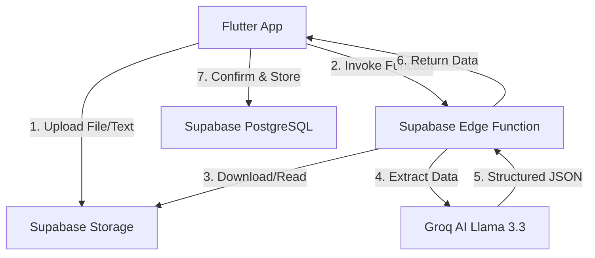

# 💰 Bachat Karo (AI Smart Budgeting)

> **Bachat Karo** — A state-of-the-art personal finance tracker built with **Flutter** and powered by **Supabase Edge Functions** + **Groq AI (Llama 3.3)**.

---

## 🎨 Overview

Bachat Karo (Hindi: *"Save Money"*) is not just an expense tracker—it's an AI-first financial companion. It allows users to manage expenses manually or import them from messy real-world sources like bank SMS, WhatsApp notes, or Excel sheets using advanced LLM-based extraction.

---

## 🚀 Key AI Features

| Feature | Description |
|---|---|
| 🧠 **AI Smart Import** | Extract expenses from messy text, `.txt`, `.csv`, `.xlsx`, or `.docx` files using **Groq Llama 3.3**. |
| 💡 **AI Insights** | Personalized financial advice and saving suggestions generated specifically for your spending habits. |
| 📊 **Auto-Categorisation** | Intelligent merchant and category detection (e.g., "Swiggy" → Food, "Uber" → Travel). |
| 📈 **Real-time Analytics** | Visual spending breakdowns by category and trends over time. |

---

## 🏗️ Architecture & Workflow

Bachat Karo uses a modern serverless architecture to handle heavy AI processing outside the mobile app.



---

## 🛠️ Tech Stack

| Layer | Technology |
|---|---|
| **Frontend** | Flutter (Dart) |
| **Backend** | Supabase Edge Functions (Deno / TypeScript) |
| **Database** | PostgreSQL + Supabase PostgREST |
| **AI Strategy** | Groq Cloud + Llama-3.3-70b-versatile |
| **Storage** | Supabase Storage (S3-compatible) |
| **State Mgt** | Provider |

---

## 📦 File Structure

```
bachat_karo/
├── lib/
│   ├── core/                  # Configuration, Theme, Constants
│   ├── features/              # Feature modules (Auth, Expense, Import, AI Insights)
│   ├── shared/                # Common UI components
│   └── main.dart              # App entry & Initialization
├── supabase/
│   ├── functions/             # Deno Edge Functions
│   │   ├── parse-import/       # File & Text AI extraction logic
│   │   └── generate-suggestions/ # AI Insight generation logic
│   └── migrations/            # SQL Database schemas & RLS policies
├── assets/                    # Images, Fonts, and Mockups
└── pubspec.yaml               # Flutter dependencies
```

---

## 🚀 Getting Started (Step-by-Step)

### 1. Prerequisites
- **Flutter SDK**: `^3.0.0`
- **Docker Desktop**: Required for Supabase CLI to build Edge Functions.
- **Supabase CLI**: `npm install supabase --save-dev`
- **Groq API Key**: Get it from [Groq Console](https://console.groq.com).

### 2. Clone and Install
```bash
git clone https://github.com/Chandrabhanu-Prusty/Bachat-Karo.git
cd Bachat-Karo
flutter pub get
```

### 3. Deploy Edge Functions
1. **Login & Link**:
   ```bash
   npx supabase login
   npx supabase link --project-ref your-project-id
   ```
2. **Set Secrets**:
   ```bash
   npx supabase secrets set GROQ_API_KEY=your_key_here
   ```
3. **Deploy**:
   ```bash
   npx supabase functions deploy parse-import --no-verify-jwt
   npx supabase functions deploy generate-suggestions --no-verify-jwt
   ```

### 4. Database Setup
Run the migrations in your Supabase SQL Editor or via the CLI to create the `expenses` and `ai_suggestions` tables.

### 5. Config Update
Update `lib/core/supabase/supabase_config.dart` with your **Project URL** and **Anon Key**.

---

## 🔐 Security (RLS)
The project implements strict **Row Level Security**:
- Users can ONLY view and edit their own expenses.
- AI Suggestions are restricted to the account owner.
- Storage files are stored in private user-prefixed paths.

---

## 🤝 Contributing
Feel free to fork, open issues, or submit PRs! We are looking for:
- More extraction support (PDFs, Images).
- Advanced budget goal setting features.

---

<p align="center">Made with ❤️ for the AI Mini Project</p>
